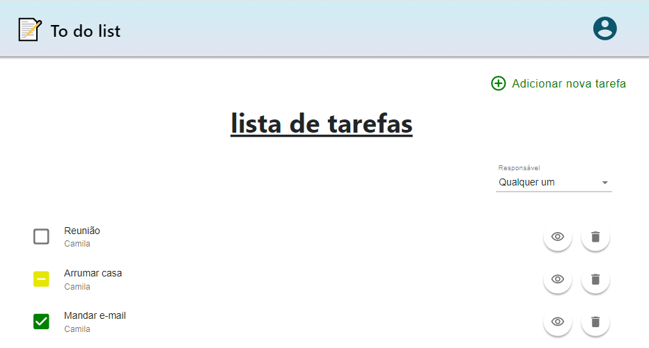

#  
 To do list 

 

  

 

## 💻 Projeto

Lista de afazeres implementada utilizando o Meteor React.

##  💻 Tecnologias

Esse projeto foi desenvolvido com as seguintes tecnologias:

- Meteor React
- ReactJS
- HTML
- CSS
- MongoDB

 
##  🚀 Para executar:

### Requisitos

- Você vai precisar instalar o [Npm](https://www.npmjs.com/) (ou o [Yarn](https://yarnpkg.com/)), o [Node.js](https://nodejs.org/en/download/) e o [Meteor](https://www.meteor.com/developers/install) no seu projeto.

* Clone o projeto
* Instale as dependências com meteor npm install (ou meteor yarn install)
* Inicie o projeto com meteor run

O aplicativo estará disponível para acesso em `http://localhost:3000/`

-----------------------------------------------------------------

Esse projeto foi feito utilizando o tutorial inicial do Meteor.

